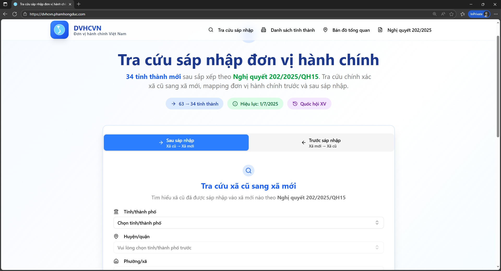
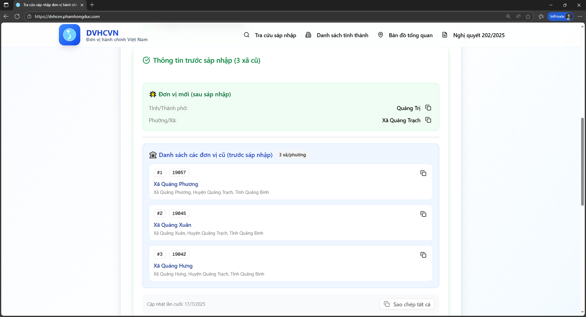
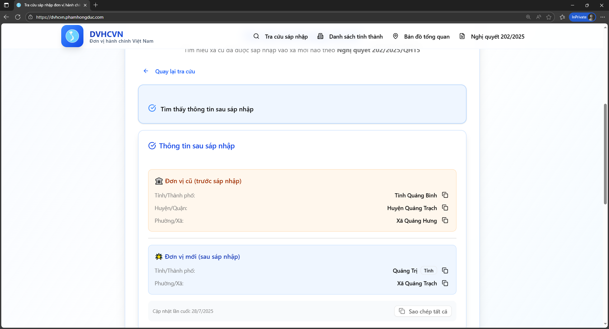
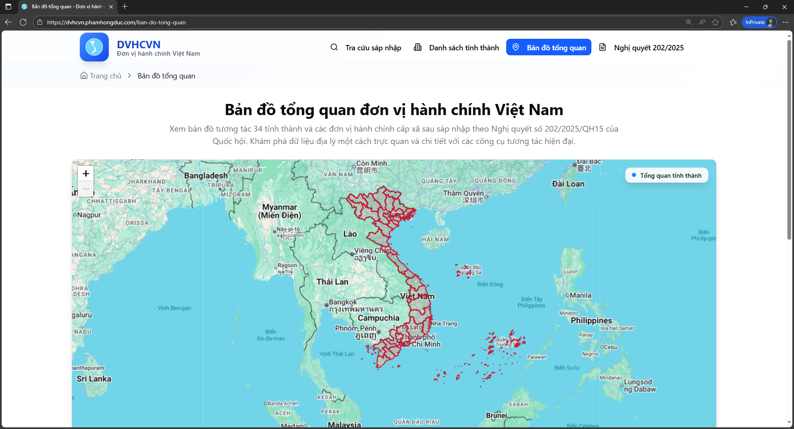
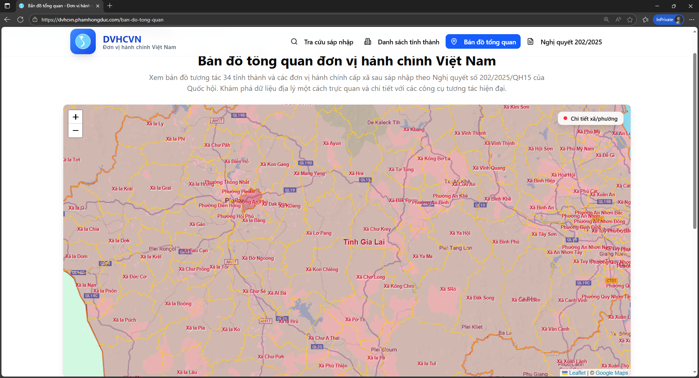
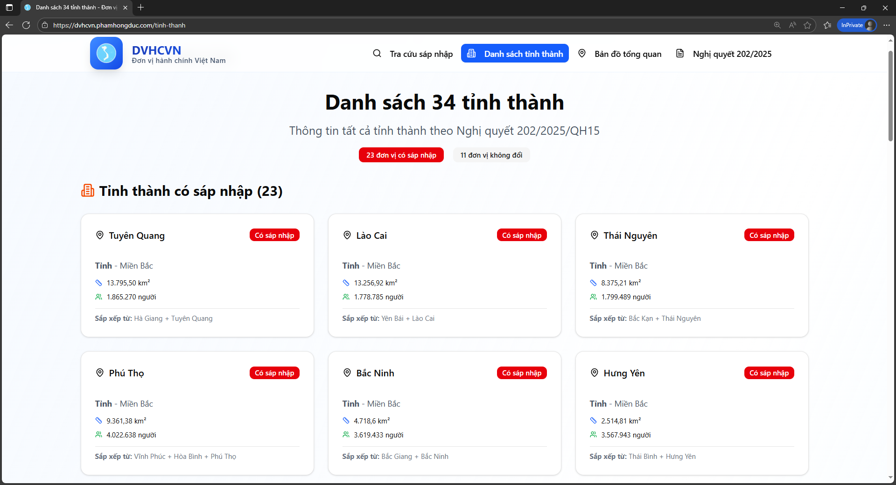
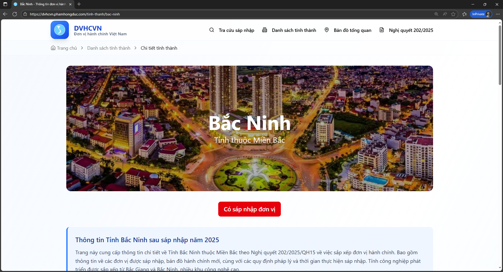
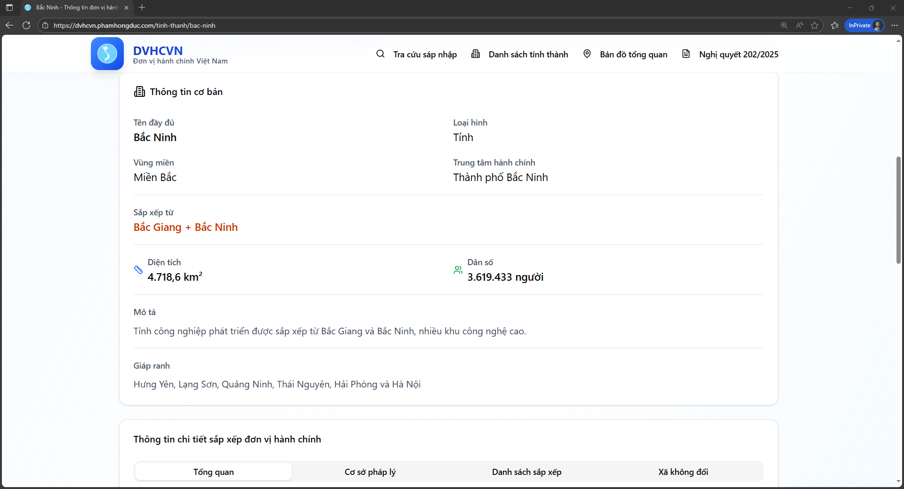

# 🇻🇳 DVHCVN - Tra cứu sáp nhập đơn vị hành chính Việt Nam 2025

<p align="center">
  
</p>

<p align="center">
  <strong>Tra cứu chính xác đơn vị hành chính Việt Nam sau sáp nhập 2025</strong><br>
  <em>Từ 63 tỉnh thành về 34 tỉnh thành theo Nghị quyết 202/2025/QH15</em>
</p>

<p align="center">
  <a href="https://dvhcvn.phamhongduc.com">🌐 Website Live</a> •
  <a href="#tính-năng">✨ Tính năng</a> •
  <a href="#demo">📸 Demo</a> •
  <a href="#tại-sao-chọn-dvhcvn">🌟 Tại sao chọn</a>
</p>

---

## 📋 Giới thiệu

**DVHCVN** là ứng dụng web tra cứu đơn vị hành chính Việt Nam sau quá trình sáp nhập theo **Nghị quyết 202/2025/QH15** của Quốc hội, giúp người dân và doanh nghiệp tra cứu chính xác thông tin về:

- 🏛️ **34 tỉnh thành mới** sau sáp nhập (từ 63 tỉnh thành cũ)
- 🗺️ **Mapping xã cũ sang xã mới** với độ chính xác cao
- 📊 **Thống kê chi tiết** về quá trình sáp nhập
- 🔍 **Tìm kiếm nhanh** theo tên cũ hoặc mới

## ✨ Tính năng chính

### 🔍 Tra cứu thông minh

- **Tìm theo tên cũ**: Nhập tên tỉnh/huyện/xã cũ → Hiển thị thông tin mới
- **Tìm theo tên mới**: Nhập tên mới → Xem danh sách các đơn vị cũ được sáp nhập

### 🗺️ Bản đồ trực quan

- **Bản đồ tương tác**: Hiển thị ranh giới trước và sau sáp nhập
- **So sánh trực quan**: Xem sự thay đổi về địa giới hành chính
- **Zoom và pan**: Khám phá chi tiết từng khu vực

### 📊 Thống kê và phân tích

- **34 tỉnh thành mới**: Danh sách đầy đủ với thông tin chi tiết
- **11 tỉnh không sáp nhập**: Danh sách các tỉnh giữ nguyên
- **23 tỉnh có sáp nhập**: Chi tiết quá trình sáp nhập
- **Thống kê số liệu**: Tổng hợp các con số quan trọng

### ⚡ Hiệu năng cao

- **Tìm kiếm tức thì**: Kết quả hiển thị trong < 100ms
- **Cache thông minh**: Tối ưu tốc độ truy xuất
- **Mobile responsive**: Hoạt động mượt trên mọi thiết bị

## 📸 Demo

### 🏠 Giao diện chính


_Giao diện trang chủ với thiết kế hiện đại và thân thiện người dùng_

### 🔍 Tính năng tra cứu

#### Tra cứu trước sáp nhập


_Kết quả tra cứu thông tin đơn vị hành chính trước khi sáp nhập_

#### Tra cứu sau sáp nhập


_Kết quả tra cứu thông tin đơn vị hành chính sau khi sáp nhập_

### 🗺️ Bản đồ tương tác

#### Bản đồ tổng quan cấp tỉnh


_Bản đồ tương tác hiển thị ranh giới 34 tỉnh thành mới_

#### Bản đồ tổng quan cấp xã


_Bản đồ chi tiết cấp xã phường với ranh giới hành chính_

### 📋 Thông tin chi tiết

#### Danh sách 34 tỉnh thành


_Danh sách đầy đủ 34 tỉnh thành mới sau sáp nhập_

#### Chi tiết tỉnh thành


_Thông tin chi tiết về quá trình sáp nhập của các tỉnh thành_


_Phân tích và thống kê chi tiết về sự thay đổi hành chính_

---

> 💡 **Khám phá thêm**: Đây chỉ là một số hình ảnh demo. Để trải nghiệm đầy đủ các tính năng và khám phá chi tiết hơn, hãy truy cập **[🌐 dvhcvn.phamhongduc.com](https://dvhcvn.phamhongduc.com)** ngay!

## 💡 Ý tưởng và Giá trị

### 🎯 Giải quyết vấn đề thực tế

- **Thông tin chính xác**: Dữ liệu được cập nhật theo Nghị quyết chính thức
- **Dễ sử dụng**: Giao diện thân thiện, tìm kiếm nhanh chóng
- **Miễn phí**: Phục vụ cộng đồng không thu phí
- **Luôn cập nhật**: Theo dõi và cập nhật thay đổi liên tục

### 🌟 Điểm khác biệt

- **Độ chính xác cao**: Dữ liệu được cập nhật từ nguồn chính thức
- **Tìm kiếm thông minh**: Hỗ trợ nhiều cách tìm kiếm khác nhau
- **Trải nghiệm tốt**: Thiết kế UX/UI tối ưu
- **Hiệu năng cao**: Tối ưu tốc độ truy cập và tìm kiếm

## 🌟 Tại sao chọn DVHCVN?

### ✅ **Độ tin cậy cao**

- **Nguồn dữ liệu chính thức**: Cập nhật trực tiếp từ Nghị quyết 202/2025/QH15
- **Kiểm tra kép**: Mọi thông tin được cross-check với nhiều nguồn
- **Cập nhật liên tục**: Theo dõi và cập nhật ngay khi có thay đổi

### 🚀 **Trải nghiệm người dùng tốt nhất**

- **Tìm kiếm nhanh**: Kết quả hiển thị tức thì, không cần chờ đợi
- **Giao diện thân thiện**: Dễ sử dụng cho mọi đối tượng người dùng
- **Mobile-first**: Tối ưu cho điện thoại, máy tính bảng

### 🆓 **Hoàn toàn miễn phí**

- **Không quảng cáo**: Trải nghiệm sạch, không bị làm phiền
- **Không giới hạn**: Tra cứu không hạn chế số lần
- **Minh bạch**: Dữ liệu và thông tin rõ ràng, đáng tin cậy

## 📊 Thống kê dự án

- ✅ **Độ chính xác cao** - Dữ liệu từ Nghị quyết chính thức
- 🏃‍♂️ **< 100ms** - Thời gian phản hồi trung bình
- 📱 **100% responsive** - Tương thích mọi thiết bị
- 🌐 **99.9% uptime** - Độ tin cậy cao
- 🔍 **63 → 34** - Tỉnh thành được mapping đầy đủ
- 📍 **10,000+** - Xã phường được tra cứu chính xác

## 🎯 Đối tượng sử dụng

- 🏛️ **Cơ quan nhà nước**: Cập nhật thông tin hành chính
- 🏢 **Doanh nghiệp**: Cập nhật địa chỉ, mã số thuế
- 👥 **Người dân**: Tra cứu thông tin cá nhân
- 🎓 **Nghiên cứu**: Dữ liệu phục vụ phân tích
- 💻 **Developer**: API cho các ứng dụng khác

## 🗂️ Cấu trúc dữ liệu

```
📊 Dữ liệu DVHCVN
├── 🏛️ 34 tỉnh thành mới
├── 🗺️ 63 tỉnh thành cũ (mapping)
├── 🏘️ 700+ huyện/quận/thành phố
├── 📍 10,000+ xã/phường/thị trấn
└── 🔗 Relationship mappings đầy đủ
```

## 🏁 Trạng thái dự án

### ✅ **Hoàn thành 100%**

Dự án đã được phát triển hoàn chỉnh với đầy đủ tính năng:

- [x] **API tra cứu đầy đủ** - Hỗ trợ tất cả loại tra cứu
- [x] **Giao diện web responsive** - Tối ưu cho mọi thiết bị
- [x] **Bản đồ tương tác** - Hiển thị trực quan ranh giới
- [x] **Tìm kiếm thông minh** - Hỗ trợ nhiều cách tìm kiếm
- [x] **Hiệu năng cao** - Tối ưu tốc độ tải và tìm kiếm
- [x] **Analytics** - Theo dõi usage và performance

### 🔒 **Bản stable - Không cập nhật thêm tính năng mới**

Dự án hiện tại ở trạng thái **maintenance mode**, chỉ sửa lỗi quan trọng nếu phát hiện.

## 📞 Liên hệ

- 🌐 **Website**: [dvhcvn.phamhongduc.com](https://dvhcvn.phamhongduc.com)
- 📧 **Email**: [nroduc.contact@gmail.com](mailto:nroduc.contact@gmail.com)
- 💼 **LinkedIn**: [phamhongduc](https://linkedin.com/in/phamhongduc)
- 🐙 **GitHub**: [@phamhongduc-dev](https://github.com/phamhongduc-dev)

## 📄 License

Dự án này được phát hành dưới giấy phép **MIT License**.

---

<p align="center">
  <strong>⭐ Nếu dự án hữu ích, hãy cho một star nhé! ⭐</strong><br>
  <em>Made with ❤️ in Vietnam 🇻🇳</em>
</p>
